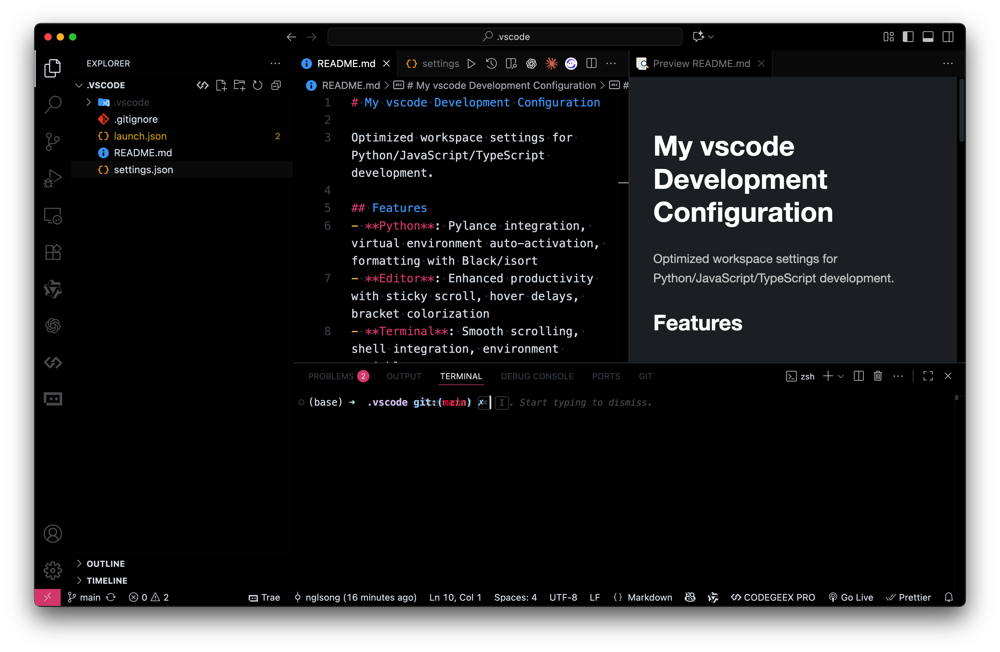

# My vscode Development Configuration

Optimized workspace settings for Python/JavaScript/TypeScript development.

> One Hunter Theme (Vercel)
## Features
- **Python**: Pylance integration, virtual environment auto-activation, formatting with Black/isort
- **Editor**: Enhanced productivity with sticky scroll, hover delays, bracket colorization
- **Terminal**: Smooth scrolling, shell integration, environment variables
- **Git**: Auto-fetch, smart commit, decorations enabled

## Setup
1. Git clone this `.vscode` project to your project root
```shell
git clone https://github.com/szj2ys/.vscode.git
```
2. Install recommended extensions when prompted
3. **Important**: Select correct Python interpreter in VS Code if environment doesn't auto-activate

## Key Shortcuts
- Virtual env path: `${workspaceFolder}/.venv/bin/python`
- Debug configs: Python current file, TypeScript with ts-node
- Formatting: Auto-format on save enabled
